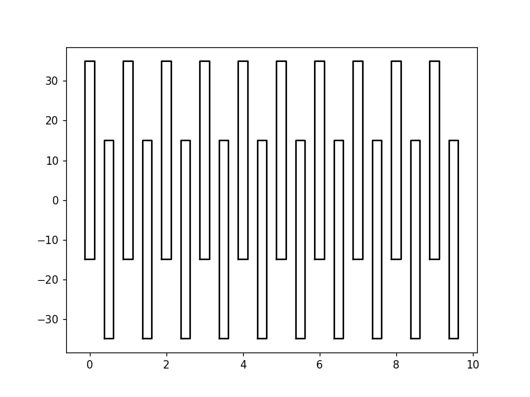
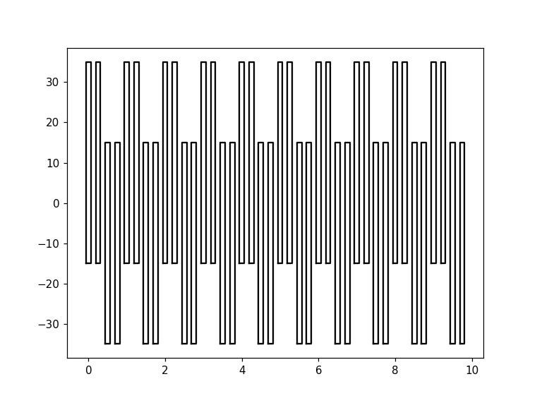
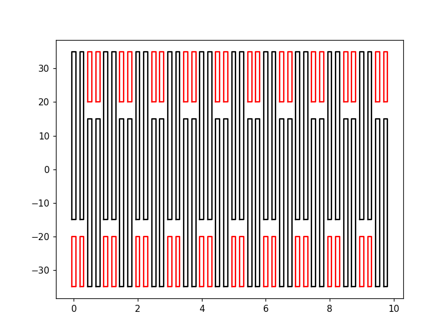
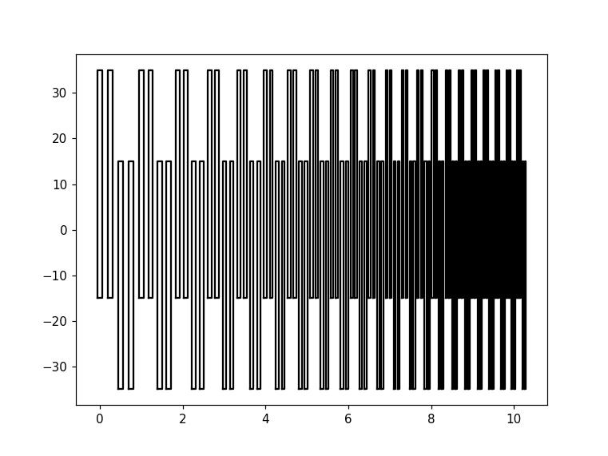
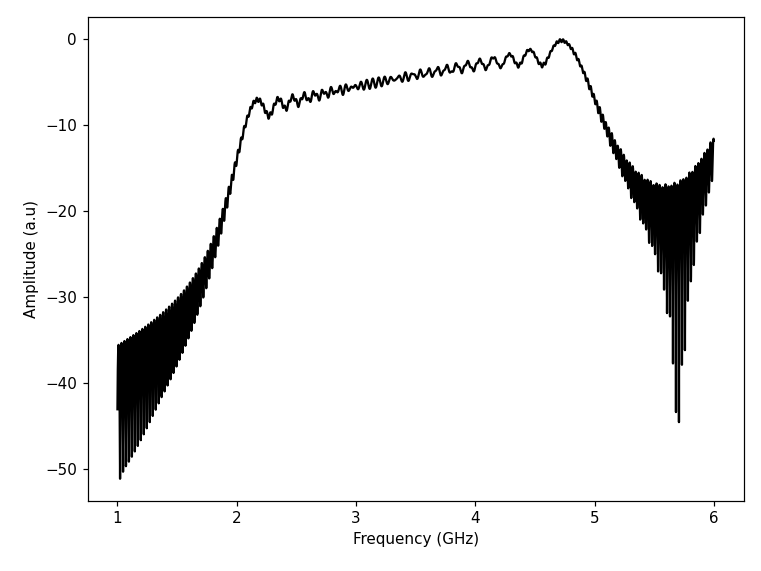
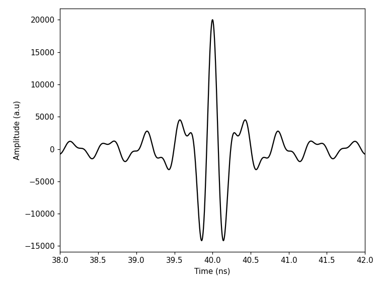
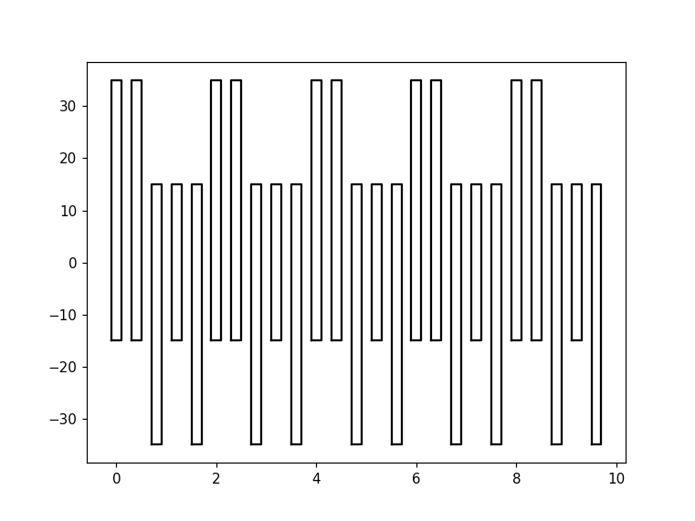
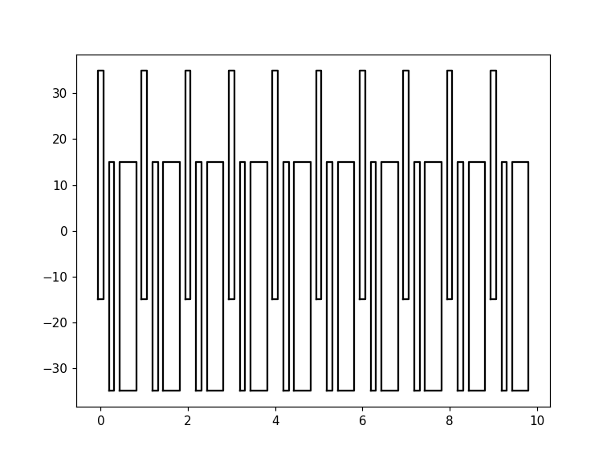

# idtpy

[comment]: <> ([![BSD-3-Clause]&#40;https://img.shields.io/github/license/nextnanopy/nextnanopy&#41;]&#40;https://opensource.org/licenses/BSD-3-Clause&#41;)

[comment]: <> ([![Downloads]&#40;https://img.shields.io/github/downloads/nextnanopy/nextnanopy/total&#41;]&#40;https://github.com/nextnanopy/nextnanopy/releases&#41;)

`idtpy` is a user-friendly Python package for **Interdigital Transducers (IDTs)**. 
Our goal is to **simplify the design process** by focusing in physical parameters (e.g. resonant frequency) and providing 
**simple modelling tools** to predict the transducer response, both in the frequency and in the time domain.

`idtpy` further allows **exporting easily the IDT design** to a common CAD format, GDSII, thus it smoothly integrates with
standard fabrication processes.

Currently, the **available IDT designs** are:
- **Regular IDT**: standard and uniform design.
- **Exponential Chirp IDT**: non-uniform design. See Junliang Wang et al. XXX (2022)
- **Linear Chirp IDT**: non-uniform design. See Junliang Wang et al. XXX (2022)
- **Split52 IDT**: generation of higher harmonics. See Florian Schulein et al. Nature Nanotechnology (2015)
- **Dart IDT**: unidirectional SAW emission. See Etienne Dumur et al. Applied Physics Letters (2019) 

## What is an Interdigital Transducer (IDT)?
IDTs are widely used in telecommunication industries as filters or delay lines, and recently also found its applications
in quantum technologies.
It is composed by surface metallic electrodes deposited on a piezoelectric substrate.
Applying an oscillating input signal, a surface acoustic wave (SAW) is generated thanks to the piezoelectric coupling.
The properties of this emitted SAW is determined by the design of the electrodes.
Changing the unit cell pattern allows for instance extension in the frequency band response (chirp IDT), 
unidirectional emission (Dart IDT) or generation of higher harmonics (Split 52 IDT).

## Cite
If you use `idtpy` in any scientific publication, please, cite it as XXX.

## Installation
### Requirements

You need a working Python installation to be able to use `idtpy`. 
We highly recommend installing Anaconda which takes care of installing Python and managing packages. 
Make sure to download Python 3.8 or later.

### Dependencies:

* [Python](https://www.python.org/) (tested with 3.8)
* [NumPy](http://numpy.scipy.org/) - `conda install numpy`
* [Gdspy](https://gdspy.readthedocs.io/) (optional: to generate gds files) - `pip install gdspy`
* [Matplotlib](https://matplotlib.org/) (optional: to visualize IDTs) - `conda install matplotlib`

### Linux / OS X / Windows

#### Option 1: Using [pip](https://docs.python.org/3/installing/)

Simply open Anaconda prompt and type:

```sh
pip install idtpy
```

#### Option 2: From the source code

1. Download the source from [github](https://github.com/Junliang-Wang/idtpy)
2. Open Anaconda prompt
3. Go to the directory of the `idtpy` project
4. Build/install by typing:

```sh
python setup.py install
```

## Examples
More examples can be found in the folder ['examples'](https://github.com/Junliang-Wang/idtpy/tree/main/examples).

### Create an IDT
```python
from idtpy import designer
reg = designer.Regular(
    freq=1, # resonant frequency
    vsaw=1, # SAW speed
    Np=10, # number of periods
    w=30, # overlap width between opposite electrodes
    l=20, # vertical length after the overlap
    Nehp=1, # number of electrodes per half period. 1=single-finger, 2=double-finger...
    tfact=1, # thickness factor
)
```

### Preview it with matplotlib
```python
import matplotlib.pyplot as plt
fig, ax = plt.subplots(1)
reg.show(ax, color='k')
```

### Make it double finger easily
```python
reg = designer.Regular(
    freq=1, # resonant frequency
    vsaw=1, # SAW speed
    Np=10, # number of periods
    w=30, # overlap width between opposite electrodes
    l=20, # vertical length after the overlap
    Nehp=2, # number of electrodes per half period. 1=single-finger, 2=double-finger...
    tfact=1, # thickness factor
)
```


### Add dummy electrodes
```python
dummies = reg.dummies(gap=5)
reg.show(ax, color='k')
dummies.show(ax, color='r')
```


### Create a chirp IDT
```python
chirp = designer.ExpChirp(
    fmin=1, # minimum frequency
    fmax=4, # maximum frequency
    T=10, # IDT length in time
    vsaw=1,
    w=30, 
    l=20, 
    Nehp=2, 
    tfact=1,
)
```


### Model the frequency response
```python
import numpy as np
from idtpy import model
freq = np.arange(1, 6, 0.001)

idt = model.ExpChirp(fmin=2,fmax=5,T=40,phi0=0,t0=0)
f_res = idt.freq_response(freq, apodized=False, db=True, shp=1).real

plt.plot(freq, f_res, 'k')
```


### Predict the SAW shape with an input voltage

```python
dt = 0.001
input_signal = model.ExpChirp(fmin=2,fmax=5,T=40)
ideal_wf = idt.apply_waveform(input_signal, dt)

time = np.arange(0, 80, dt)
t_res = ideal_wf.time_response(time).real

plt.plot(time, t_res, 'k')
```


### Split52 design
```python
split = designer.Split52(
    freq=0.5, 
    vsaw=1, 
    Np=5, 
    w=30, 
    l=20, 
    tfact=1,
)
```


### Dart design
```python
dart = designer.Dart(
    freq=1, 
    vsaw=1, 
    Np=10, 
    w=30, 
    l=20, 
    tfact=1,
    direction='r',
)
```


### Export to GDS
```python
from idtpy import GdsAssistant
idt = designer.Regular(freq=2.77,vsaw=2.77,Np=40,w=30,l=50,Nehp=2,tfact=[0.8,0.64,20])
gds = GdsAssistant('library')
top = gds.new_cell('top')
top.add(gds.get_gds_polygons(idt,layer=0))
gds.save('idt.gds')
```

### Version 0.1.0 (December 16th, 2021)
* Initial release